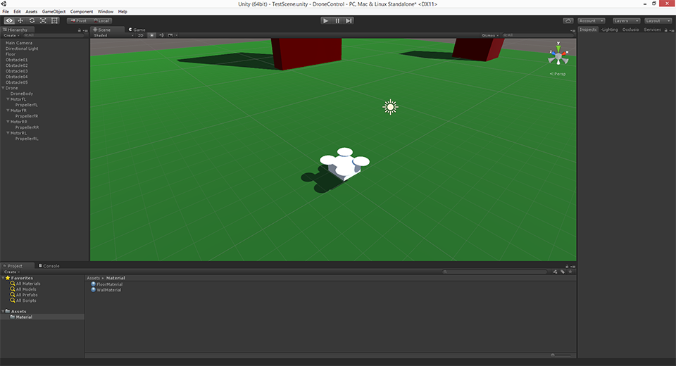
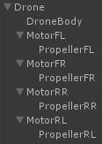
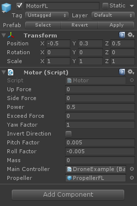

## Introduction ##
Quad-copters are growing common today.  We are always reading or watching videos on new models, parts, technologies and several awesome skilled pilot acrobatics.

Including on those videos and news, there are "drone races". several "drone" adept gather together to put their own machines on trial. Most of us can only watch and admire the show. Even due expenses in building and repairing a drone or due lack of skill or time in training to become a pilot. That's where video-games always fit in.

As every real-world based game we have a small portion of that reality being simulated in the game.  Quad-copters are not exception.  The idea in this project is to implement a virtual controlled quad-copter adapted to be used in games. We have to start from understanding the basic quad-copter concepts and bring them to a game reality.

## About the project ##
There is a commercial game that uses the exactly concept I'm showing here. It's the [Drone Battleground](https://webdivershaka.github.io/). the idea is to implement a multiplayer battleground where drone teams can play a "capture the flag" game.
We'll be working on a Unity 5 project with no external assets to serve as guide/example.  The project can be found on the current stage here at this Github repository.  It's recommended that you know basics on Unity and C# for a better understanding on this documents.

---

## Drone physics ##
A real drone depends on several elements acting together to make it lift, move and fly. Those elements involves lots of aerodynamics and mechanics study. That's not the idea in this project. We are going to take things simple here. Simple in a form that still look likes a drone control but easy enough to be applied in a game without make it hard for both players and developers.
First of all, lets understand the movements and forces involved in making a drone fly. There are four different movements a drone can perform. The combination of them make the other maneuvers possible. The first movement is a translation, the other three are rotations around a certain axis of the vehicle:

+ __Lift / Fall__: This is basically the vertical movement. Increase each motor power and the drone gains altitude, decrease and the gravity pulls it down. We have to keep in mind that lift depends on the drone level. This is exactly what will allow us to make them to move sideways and forward/backward;

+ __Pitch__: As every Unity object, pitch represents the rotation around the X axis. It's caused, in quad copters, by applying different powers between front and rear motors;</li>
+ __Roll__: Once again, based on Unity, this represents the rotation around the Z axis. It's caused, in quad copters, by applying different powers between left and right motors;</li>
+ __Yaw__: This is the Y axis rotation. This particular rotation is challenging to be done in quad-copters because it depends on the torque reaction on clockwise and counter-clockwise motors. Fortunately, as we shall see later on, there is an easy way to simulate it in Unity with almost no calculations.

To achieve each movement, there are four motors (for quad-copters). Each one has its spin direction and propeller pitch.  The combination of them, when applied the same power will lift the quad-copter straight up. By varying the power on each motor we force the quad-copter to perform any of the rotation movements.

---

## Implementation ##
Despite several complex calculations necessary to make a real drone fly, in a simulated environment, specially a game, all we have to keep in mind are the forces involved. Basically, for this first part, we'll scratch a script that apply forces on every motor position according to input axis.

### The example scene ###
With an empty scene, let's add a "floor" made by a large 100 x 100 x 0.1 cube (preferable in a distinct color). Other random cubes can be created to serve as obstacle and a light source.

### The drone model ###
We are not using a 3D model to represent the drone, thought it can be done by adding a cube with four cylinders on each corner of it. Those corners will be the points where we may apply the forces for lift, pitch and roll.  Later on, those cylinders will be replaced by propellers.
This is the basic object hierarchy:

It's a good practice to create *mesh* `GameObject` as child from empty one. That's also important in case of propeller, since we'll need to create the rotation effect later.

### Understanding the source example ###

In the editor, it's necessary to add each motor to the `Motors` property.  In addiction, include `Throttle` as input alias.  It's highly recommended to use an analog game controller, but the keyboard can be used fine, just take it easy by pressing the throttle key.

By selecting the `DroneExample` Object we can notice two scripts added to it:  The `BasicControl` and the `ComputerModule` Script.  The fists one is the *main* script that make de drone flies.  It's The main responsibility if it is to gather together input and sensors (given by `ComputerModule`) and pass them to each motor. There are 4 Motors added in this example. They have their own parameters.

The `ComputerModule` have the *sensor* part for the drone. The _Gyroscope_, the _Altimeter_ and most important, the PID variables.

It's possible, and interesting to change those values and watch out the results.

The Motors have one script too. Each Motor has a `Motor` Script where it's parameters are given:

The parameters:  `Power`, `Yaw`, `Pitch` and `Roll` Factors can be adjusted to change the drone response. They're equivalent to the motor *quality*.